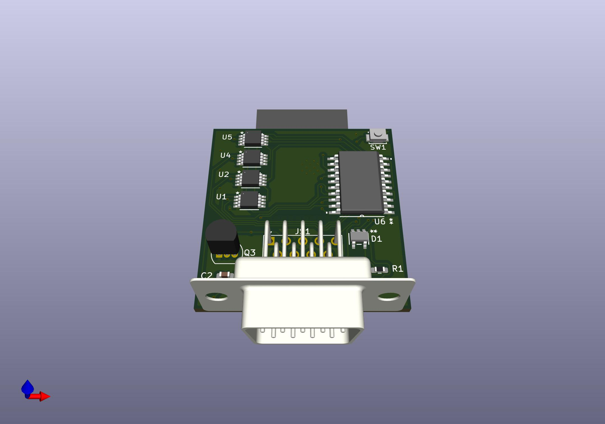
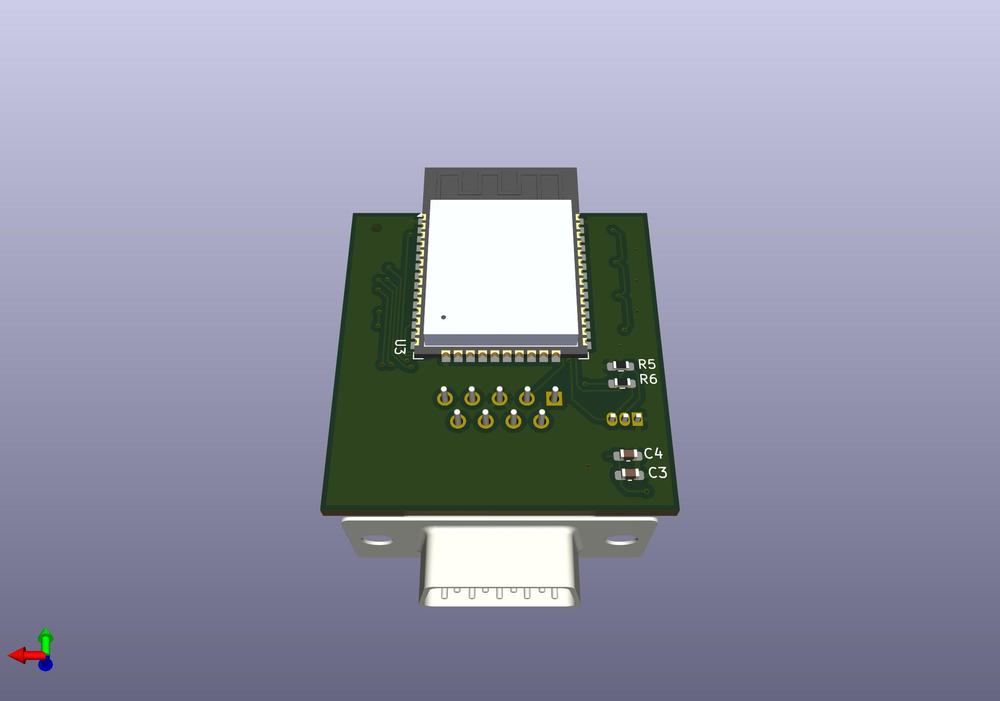
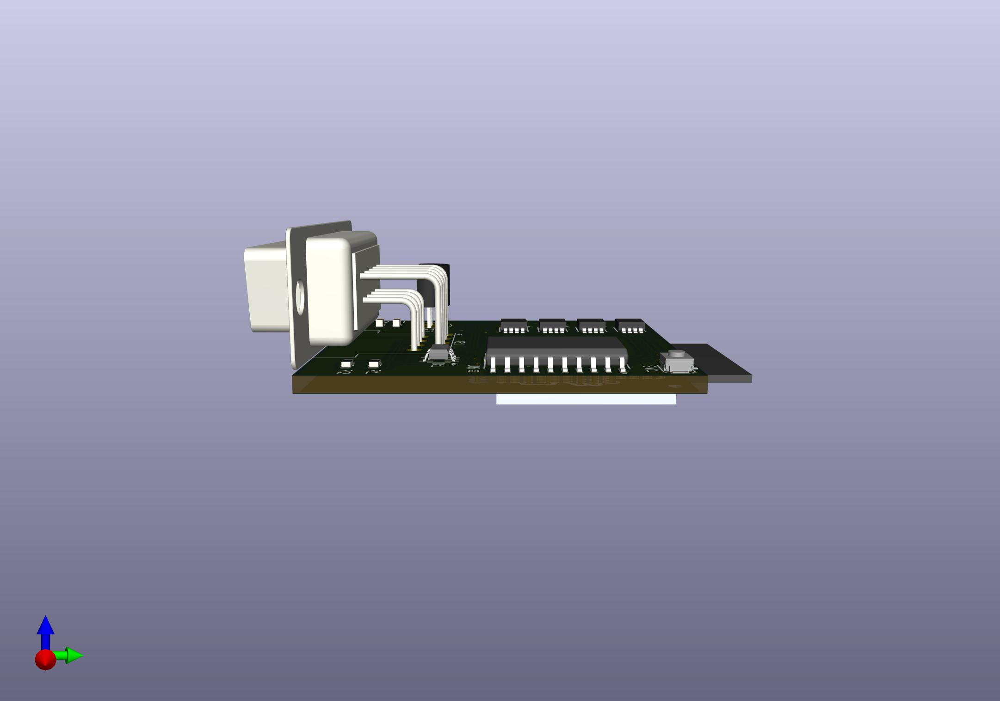

> [!WARNING]
> I'm not really a hardware guy, so there might be stupid stuff here. I assume no liability for you using this with your Apple II. Damage could occur both to it and your ESP32 if I got anything wrong or if you wire it wrong. Build one at your own risk.
> Also, this was built for my Apple IIGS and Laser 128.  They use 9 pin DE9 connectors. You'll have to figure out how to do something different if you have the 15 pin connector.

---


---

# Purpose

My old school analog joystick isn't great so I wanted to buy a "new" one. But I discovered that even crappy period correct ones are like $50 on ebay. I'm cheap and I also have a bunch of modern gamepads around. So I thought, why not build something to allow those modern gamepads to work with my Apple IIGS and my Laser 128?

So this let's you use a modern bluetooth gamepad on an Apple II. I'll probably still buy a joystick, but this was a fun project anyway.

If you do anything with electronics then you probably have a hoard of parts on hand. This project is cheap in theory if you already have common parts like breadboards, resistors, diodes, etc. Most of the components are cheap, but they only come in bulk so you'll end up paying more if you don't already have some on hand. And digikey is great but shipping is $. All in all, depending on what you have hoarded way, it'll probably cost you somewhere between $15 and $35.

Note: I also saw you can buy an A2io. I'm sure it's better, but it was $55 and it looks like it requires using a mobile device. I didn't want to have to use a mobile app and really the fun was in building this.

# Credits

I learned about how the Apple II joysticks work primarily by reading my Laser 128 technical reference manual and [this article](https://blondihacks.com/apple-ii-gamepad-prototype/) by Quinn Dunki.

For the ESP32/bluetooth side, this project uses Bluepad32. Here are some links I found helpful.
* [Some Bluepad32 docs](https://gitlab.com/ricardoquesada/bluepad32/-/blob/main/docs/plat_arduino.md#1-add-esp32-and-bluepad32-board-packages-to-board-manager)
* [ESP-IDF + Arduino + Bluepad32 template app](https://github.com/ricardoquesada/esp-idf-arduino-bluepad32-template)


# Usage

## Connecting everything

Plug the DE9 into your joystick port. Plug your ESP32 into USB. They are powered separately. See the section below on power rails, but generally it should be fine to do this in either order. It's probably a good idea to do this with your Apple off.

## Pairing controllers

By default, bluepad32 pairing is automatic when devices are put in pairing mode. Instead, I implemented an on-device pairing mode so that you can ignore new controllers if you're trying to pair them with other devices in the area. To pair a new controller, you need to bring Pin 13 to low. You can do this with a physical switch or if you're using a breadboard just connect Pin 13 to ground.

If you have one controller connected, then connect another one, the second one will be the one used.

## Calibrating your controller

You may find that center on your joystick isn't center on the Apple II. See the section on how analog sticks work and you can probably guess why. Not to mention you may have decades old capacitors in your machine.

Pressing L1 and R1 simultaneously on your controller will capture an offset value for x and y and apply this to your joystick readings. This allows you to center the controller. If you have the TotalReplay image (google it), there's a joystick program you can use. You can move the stick until it's in the center and press L1 and R1.

The calibration is saved in flash memory so it will stick even when you remove power.

# How this stuff works if you want to build one

As mentioned in the warning at the top of this readme, I know just enough hardware stuff to get by. And not enough to get by in some cases. So if you're reading this and you see I'm wrong about something or did something dangerous, let me know! Especially if there's risk of damaging an Apple II! Better yet, contribute some code or modify the design if you have a better way.

## Analog sticks using digital potentiometers (used as rheostats)

Traditional Apple II analog joysticks were pretty simple. Inside are two 150k ohm potentiometers, one for each axis. As you move the stick, it adjusts the potentiometers (pots) and changes the resistance in a circuit on the Apple II. The computer measures how long it takes to charge an internal capacitor through that resistance. Because the charging time varies, it can detect fine movements and exact angles. This is pretty cool compared to digital joysticks like the C64 or Ataris used, which were simple on-off switches for four directions.

This project works by using digital potentiometers (digipots). It converts the position of the stick on your modern gamepad to resistance values for the digipots. The Apple II expects between 0 and 150kohms resistance but 150kohm resistors are hard to find. So this project uses two 100kohm digipots in series per axis.

If you want to make it cheaper, you can probably just use one 100kohm digipot per axis. You may lose some range, though. I haven't tried this, but it seems like that's what others have done when they've built physical joysticks, and the common complaint is that it may not work great for things like flight simulators.

The code basically sets the two MCP4161 digipots per axis to the same wiper values and wires them in series. E.g. to get 150kohms of resistance, both digipots are set to 75kohm.

Also, my oldschool joystick allowed close to a square movement pattern. My modern gamepads are pretty constrained to a circle. So the code "squares the circle" a bit to provide a more authentic response. You can control how much by tweaking the code. See the SQUARENESS value.

Finally, there are some variables you can set to control how low the wipers can go. Play with those if you want. See WIPER\\_MIN\_SAFE.

## Buttons

Apple II buttons are quite simple. We get the button state from bluepad32. When a button is not being pressed, we want the Apple II button switch input to float. When it's being pressed, we bring it to 5V through a 470 ohm resistor. We make use of a diode for this.

## Power rails

This project interfaces an ESP32 (3.3V logic) with an Apple II (5V logic). Because these devices operate at different voltages, some care was taken to ensure signal integrity and hardware safety. Again, I'm not an expert so please point out any flaws in the design.

## Level shifting, isolation, and fail-safe

All 3.3V SPI and control signals from the ESP32 are level-shifted through a 74HCT245 bus transceiver.
* The 74HCT245 is powered by the 5V rail from the Apple II Game I/O port.
* Note: The "T" variant (HCT) is used because its input threshold is compatible with 3.3V logic but it can output 5V for the Apple II and digipots.

To prevent backfeeding power or sending spurious SPI commands to the digipots when one system is off, the 74HCT245's OE pin is managed by a hardware failsafe.
* A 10K pullup resistor connects the OE pin to the Apple II 5V rail. So if the ESP32 is not connected or is powered down, OE is HIGH and the buffer is in a high impedance state.
* A 2N7000 MOSFET acts as an inverter. When the ESP32 GPIO pins initialize and drive the MOSFET Gate HIGH, the MOSFET pulls the OE pin to ground, enabling the outputs.

Note: The 2N7000 has a gate threshold that can range up to 3.0V. Since the ESP32 outputs 3.3V, there isn't much overhead for the transistor to turn fully on. This should still be sufficient for switching the OE pin, but your mileage may vary. To test, check the voltage at the OE pin. It should drop reasonably close to 0V when the ESP32 is active. A logic-level MOSFET with a lower gate threshold is probably better, but I had a ton of these on hand and it's working for me.

## Parts list

Here's what I used in building this device. It would probably be cheaper to make a PCB since a lot of the expense is breadboards/breakout boards, etc. Most of what I bought came in packs of a bunch, so it could be more expensive if you don't already have stuff on hand like resistors, diodes, etc.
* 1 - [ESP32](https://www.amazon.com/dp/B0D8T53CQ5?ref=ppx_yo2ov_dt_b_fed_asin_title) - $6.67 each. Make sure you get one that supports classic bluetooth mode. Look at bluepad32's docs above to make sure.
* 1 - [ESP32 breakout board](https://www.amazon.com/dp/B0BNQ85GF3?ref=ppx_yo2ov_dt_b_fed_asin_title&th=1) - $4.33 each. Not strictly necessary but made it a lot easier to mess around.
* 4 - [MCP4161-104E/P digipots](https://www.digikey.com/en/products/detail/microchip-technology/MCP4161-104E-P/1874169) - $1.38 each
* 1- [DB9 breakout board] (https://www.amazon.com/dp/B09L7JWNDQ?ref=ppx_yo2ov_dt_b_fed_asin_title&th=1) - $7.96. You can do this with a simple male connector if you want to save money. I just found it a lot easier to wire up this way.
* About 10 [104 capacitors] - about $0.70 total.
* 1- [74HCT245N](https://www.digikey.com/en/products/detail/texas-instruments/SN74HCT245N/277258) - $0.92 each.
* 2 - 1N5817 diodes
* 1 - [2N7000 MOSFET](https://www.amazon.com/dp/B0CBKHJQZF?ref=ppx_yo2ov_dt_b_fed_asin_title&th=1) - $0.08 each. 
* Resistors. Just get a kit if you don't already have any. You'll need 6x1kohm resistors, a couple of 10K resistors, a couple of 470ohm resistors.
* Wire and terminals depending on how you want to build it.
* Breadboard or a solderable board of some kind.. Get whatever you want. A good one's about $8.

## Layout

Check out the [schematic](./schematic/schematic.kicad_sch) built using [KiCad](https://www.kicad.org/). 

Notes:
* My ESP32 had different pin numbers than the drawing shows, so just make sure the right GPIO/IO lines are used rather than paying attention to the pin numbers listed.
* I also sprinkled some 0.1 µF ceramic capacitors (104s) along the power rails (VCC to GND). These aren't shown in the drawing.
* The Apple II calls for 470ohm resistors on the buttons. On my Laser 128, that kept me borderline on button presses. I DON'T RECOMMEND IT BECAUSE THE SPEC CALLS FOR 470 ohms and I'm paranoid. But if the buttons aren't triggering you could try a lower value resistor. Do this at your own risk.

# Next steps / Possible problems

It might be good to add some physical pots for the stick calibration. Some adjustments for min/max resistance and for centering. We could get much more precise calibrations that way and you wouldn't need to use a calibration program. You could also do it mid-game.

I noticed that when you have the stick all the way down and to the left, sometimes there's an overflow and the stick will jump to the top in the joystick calibration program. This also happens with my old school physical joystick so maybe it's just a practical hardware limitation.

I've never designed a PCB before, but I think this would be pretty cheap if someone wanted to give it a go. I'd go in on it with you if you want to build a bunch. I used through hole components since I suck at soldering and am scared to try doing SMDs.

---

# Addendum by jpmhouston ... First draft of a PCB 🎉

This is made directly from the KiCad schematic, I haven't made a breadboard prototype yet. I'm a beginner at PCBs also, but started learning KiCad recently for another project.

I don't know how the details about the DE9 connector and its mounting screws. It's possible Q3 needs to be moved elsewhere, and maybe other things right beside the connector And Q3 is the one I didn't find a surface mount replacement for yet (in part because I don't really know what it is haha). The rest, beside the connector, being small surface mount components might make it light enough to stay plugged in without ever needing the screws.

I picked a push button for the pairing switch. The only thinking I did about a case is guessing that it could be made shallow at the back to allow exposing the button. I also don't know much about the ESP32 and guessed that the antenna part needs to be exposed off the board at the back, potentially exposed though an eventual case.

This board design measures 34mm wide (just under 1 3/8") x 35.8mm deep not counting the antenna (just over 1 3/8"). I I haven't yet, but I intended to make a mock up out of cardboard, see how this looks compared to real hardware (I have a //e here).







---

These are the changes made to KiCad schematic, mostly just finding replacement surface mount components but I did make changes to the symbols for the diode and DE9 connector. I'm hoping kirbyfrugia can give it a look before I do a pull request, an exported png of the schematic is in "images/kicad schematic update.png". Also FYI, some of the component choices were made with assistance from an LLM, they need to be reviewed by knowledgeable human.

```
Added model to ESP32 U1:

same data sheet, symbol, footprint
files from https://www.digikey.com/en/products/detail/espressif-systems/ESP32-WROOM-32E-N8/13159522 (saved to components/ESP32-WROOM-32E)
3d model ${KIPRJMOD}/components/ESP32-WROOM-32E/ESP32-WROOM-32E-N8.STEP (x: 90deg, dy: 3.0mm)

Picked replacement surface mount parts for U1,2,4,5:

same data sheet and symbol, new footprint and 3d model
files from https://www.digikey.com/en/products/detail/microchip-technology/MCP4161-104E-MS/1874189 (saved to components/MCP4161_104E_MS)
footprint MCP4161_104E_MS:MSOP8_MC_MCH after adding ${KIPRJMOD}/components/MCP4161_104E_MS/KiCADv6/footprints.pretty
3d model ${KIPRJMOD}/components/MCP4161_104E_MS/MSOP8_MC_MCH.step

Picked replacement surface mount part for U6:

same data sheet and symbol, new footprint and 3d model
files from https://www.digikey.com/en/products/detail/texas-instruments/SN74HCT245DW/277257 (saved to components/SN74HCT245DW)
footprint SN74HCT245DW:DW20 after adding ${KIPRJMOD}/components/SN74HCT245DW/KiCADv6/footprints.pretty
3d model ${KIPRJMOD}/components/SN74HCT245DW/DW0020A.stp

Changed JS1 to a true DE9 symbol, footprint, model:

new symbol 9-pin D-SUB connector, pins (male), Mounting Hole
footprint Connector_Dsub:DSUB-9_Pins_Horizontal_P2.77x2.54mm_EdgePinOffset9.40mm

Picked surface mount part for switch SW1:

same symbol, new data sheet, footprint and 3d model
Omron B3U-1000P-B data sheet https://omronfs.omron.com/en_US/ecb/products/pdf/en-b3u.pdf
files from https://www.digikey.com/en/products/detail/omron-electronics-inc-emc-div/B3U-1000P-B/1811777 (saved to components/B3U_1000P_B)
footprint B3U_1000P_B:B3U-1000P-B after adding ${KIPRJMOD}/components/B3U_1000P_B/KiCADv6/footprints.pretty
3d model ${KIPRJMOD}/components/B3U_1000P_B/B3U_1000P[]_B.step (x: 90deg)

Picked surface mount parts for resistors R1,2,5,6:

same symbol, new footprint and 3d model
https://pim.murata.com/asset/pim4/ceramicCapacitorSMD/GRM188D71A475KE11-01A-EN_PDF_CERAMICCAPACITORSMD
footprint Resistor_SMD:R_0603_1608Metric_Pad0.98x0.95mm_HandSolder
3d model ${KICAD9_3DMODEL_DIR}/Resistor_SMD.3dshapes/R_0603_1608Metric.step

Picked surface mount parts for capacitors C1,2,3,4:

same symbol, new footprint and 3d model
https://yageogroup.com/content/Resource%20Library/Datasheet/PYU-RC_51_ROHS_P.pdf
footprint Capacitor_SMD:C_0603_1608Metric_Pad1.08x0.95mm_HandSolder
3m model ${KICAD9_3DMODEL_DIR}/Capacitor_SMD.3dshapes/C_0603_1608Metric.step

Changed D1,2 barrier rectifier diodes to D1 single surface mount package containing 2 independent barrier rectifiers:

new symbol, footprint, 3d model
Diode Array 2 Independent 20 V 1A Surface Mount SOT-23-5 Thin, TSOT-23-5
data sheet https://fscdn.rohm.com/en/products/databook/datasheet/discrete/diode/schottky_barrier/rb496eatr-e.pdf
files from https://www.digikey.ca/en/models/926235 (saved to components/RB496EATR)
symbol RB496EATR after adding symbol ${KIPRJMOD}/components/RB496EATR/KiCADv6/2026-03-08_05-44-21.kicad_sym
footprint RB496EATR:DIO_FTZ_ROM after adding ${KIPRJMOD}/components/RB496EATR/KiCADv6/footprints.pretty
3d model ${KIPRJMOD}/components/RB496EATR/DIO_FTZ_ROM.step
```
